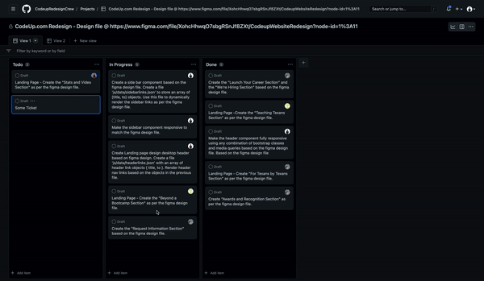
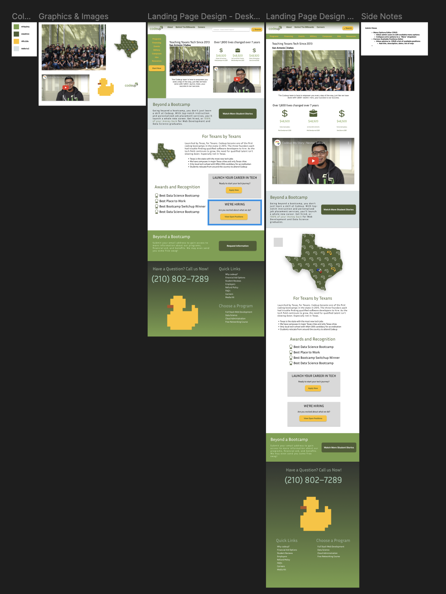

# The CodeupRedesign Crew Project

## Table Of Contents:
- [Description](#description)
- [Branching Instructions](#branching-instructions)
- [Contributors](#contributors)
- [Deployment](#deployment)
- [Reference](#reference)
- [Installation](#installation)
- [License](#license)

## Description

The site is a side project for current CodeUp Java Cohorts who are looking for additional practice and hands-on while providing additional visibility to contributing developers and their skills and expertise.  The Developers will be demonstrating their use of GitHub branching, as well as, HTML, CSS, JavaScrit along with Bootstrap and jQuery.
 
This readme document is in progress and will be expanded on as the project progresses. 

## Branching Instructions
1. Please create a branch before working on any features.
2. Name the branch something similar to the name of the feature you're working on. It makes it easier to merge everything together later.
3. Make sure you move your ticket for the feature you're working on from "Todo" to "In Progress" on the project board [which can be found here](https://github.com/orgs/CodeupRedesignCrew/projects/1).
4. When completed move your ticket to the "Done" section.
5. If you work on an unassigned ticket, make sure to assign yourself to the ticket, by clicking on the ticket on the board and clicking "Assignees" and checking the box next to your name.

###### Tickets Flow Example

## Contributors - Your name will be added to the list when you contribute to the project
- Project Manager - Ana Moreno [GitHub](https://github.com/al-moreno) | [LinkedIn](https://www.linkedin.com/in/ana-l-moreno/)
- Lead Developer  -   Aldanis Vigo    [GitHub](https://github.com/aldanisvigo) | [LinkedIn](https://www.linkedin.com/in/aldanisvigo/)
- Developer      -   Maikel Karam    [GitHub]() | [LinkedIn](https://www.linkedin.com/in/maikel-karam-38710a231/) 
- Developer      -   John M Krsak    [GitHub](https://github.com/jmkrsak) | [LinkedIn](https://www.linkedin.com/in/john-michael-krsak-474389254/)

## Deployment: 

GitHub Repo: https://github.com/CodeupRedesignCrew/CodeupRedesign

GitHub Pages: https://codeupredesigncrew.github.io/CodeupRedesign/

## Reference:

 
 Design Template: [Open in Figma](https://www.figma.com/file/XohcHhwqO7sbgRSnJf8ZXt/CodeupWebsiteRedesign?node-id=0%3A1)
## Installation:
1.  No installation if needed 
2.  You may view code through access of GitHub, link provided above.
3.  You may view site through GitHub Pages, link provided above. 

## License
MIT License

Copyright (c) 

Permission is hereby granted, free of charge, to any person obtaining a copy of this software and associated documentation files (the "Software"), to deal in the Software without restriction, including without limitation the rights to use, copy, modify, merge, publish, distribute, sublicense, and/or sell copies of the Software, and to permit persons to whom the Software is furnished to do so, subject to the following conditions:

The above copyright notice and this permission notice shall be included in all copies or substantial portions of the Software.

THE SOFTWARE IS PROVIDED "AS IS", WITHOUT WARRANTY OF ANY KIND, EXPRESS OR IMPLIED, INCLUDING BUT NOT LIMITED TO THE WARRANTIES OF MERCHANTABILITY, FITNESS FOR A PARTICULAR PURPOSE AND NONINFRINGEMENT. IN NO EVENT SHALL THE AUTHORS OR COPYRIGHT HOLDERS BE LIABLE FOR ANY CLAIM, DAMAGES OR OTHER LIABILITY, WHETHER IN AN ACTION OF CONTRACT, TORT OR OTHERWISE, ARISING FROM, OUT OF OR IN CONNECTION WITH THE SOFTWARE OR THE USE OR OTHER DEALINGS IN THE SOFTWARE.
